Ch.3 Data Visualization
================
Jerri Schorr
09-24-2019

##### **Chapter 3**

###### **3.1**

-   This chapter will cover ggplot
    -   ggplot = **grammar of graphics**
    -   uses a layering system
-   Make sure to load the "tidyverse" package to use the ggplot functions

###### **3.2**

-   I think that a smaller engine will get better gas milage, while a larger engine will get less gas mileage

``` r
ggplot2::mpg
```

    ## # A tibble: 234 x 11
    ##    manufacturer model displ  year   cyl trans drv     cty   hwy fl    cla…
    ##    <chr>        <chr> <dbl> <int> <int> <chr> <chr> <int> <int> <chr> <ch>
    ##  1 audi         a4      1.8  1999     4 auto… f        18    29 p     com…
    ##  2 audi         a4      1.8  1999     4 manu… f        21    29 p     com…
    ##  3 audi         a4      2    2008     4 manu… f        20    31 p     com…
    ##  4 audi         a4      2    2008     4 auto… f        21    30 p     com…
    ##  5 audi         a4      2.8  1999     6 auto… f        16    26 p     com…
    ##  6 audi         a4      2.8  1999     6 manu… f        18    26 p     com…
    ##  7 audi         a4      3.1  2008     6 auto… f        18    27 p     com…
    ##  8 audi         a4 q…   1.8  1999     4 manu… 4        18    26 p     com…
    ##  9 audi         a4 q…   1.8  1999     4 auto… 4        16    25 p     com…
    ## 10 audi         a4 q…   2    2008     4 manu… 4        20    28 p     com…
    ## # ... with 224 more rows

``` r
ggplot(data = mpg) + 
  geom_point(mapping = aes(x = displ, y = hwy))
```

 + This code proves that the original thought is true. As engine size increases, the gas milage decreases

-   The function "geom\_point" creates the scatter plot layer to the graph
    -   Here is a generic form of a ggplot:
    -   ggplot(data = *DATA*) + *GEOM\_FUNCTION*(mapping = aes(*MAPPINGS*))
-   Exercises

1.  You get a blank white box

``` r
ggplot(data = mpg)
```

 4. Scatter plot of hwy vs. cyl

``` r
ggplot(data = mpg) +
  geom_point(mapping = aes(x = cyl, y = hwy))
```

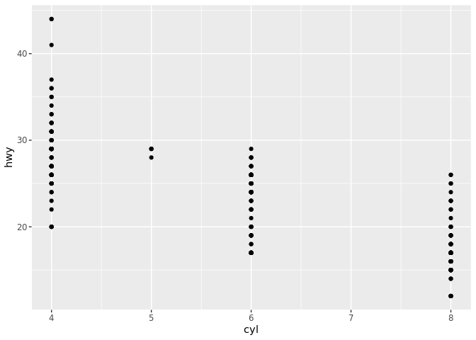 5. Scatter plot of clas vs. drv

``` r
ggplot(data = mpg) +
  geom_point(mapping = aes(x = class, y = drv))
```

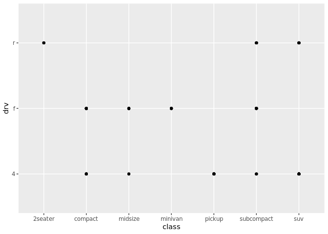

###### **3.3**

-   Changing colors and shape

``` r
ggplot(data = mpg) + 
  geom_point(mapping = aes(x = displ, y = hwy, color = class))
```


``` r
ggplot(data = mpg) + 
  geom_point(mapping = aes(x = displ, y = hwy, size = class))
```

    ## Warning: Using size for a discrete variable is not advised.


``` r
# Left
ggplot(data = mpg) + 
  geom_point(mapping = aes(x = displ, y = hwy, alpha = class))
```

    ## Warning: Using alpha for a discrete variable is not advised.

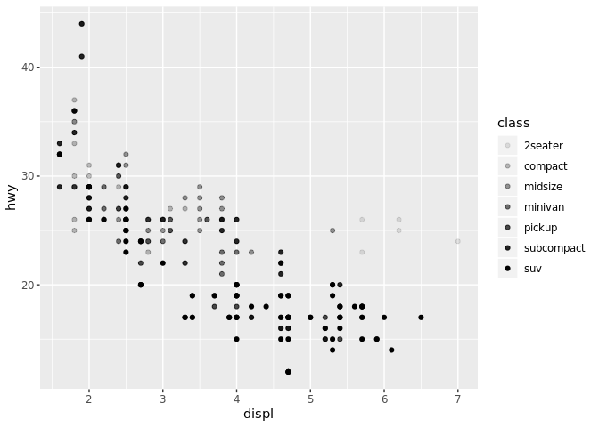

``` r
# Right
ggplot(data = mpg) + 
  geom_point(mapping = aes(x = displ, y = hwy, shape = class))
```

    ## Warning: The shape palette can deal with a maximum of 6 discrete values
    ## because more than 6 becomes difficult to discriminate; you have 7.
    ## Consider specifying shapes manually if you must have them.

    ## Warning: Removed 62 rows containing missing values (geom_point).


``` r
ggplot(data = mpg) + 
  geom_point(mapping = aes(x = displ, y = hwy), color = "blue")
```

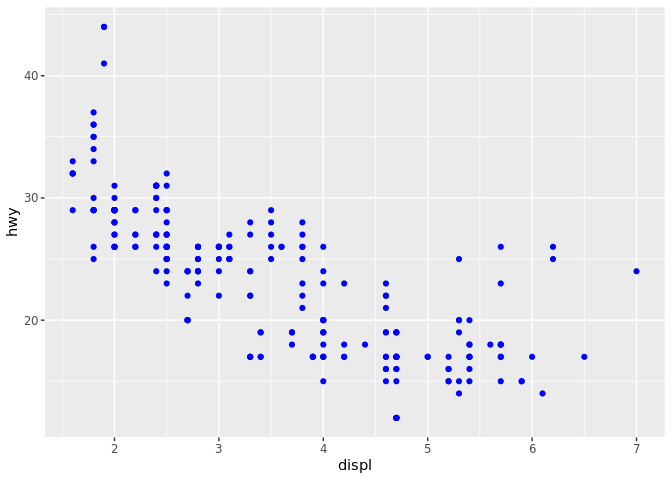

###### **3.4**

-   Common problems
    -   Make sure to put a **+** at the end of a line and not at the beginning

###### **3.5**

``` r
ggplot(data = mpg) + 
  geom_point(mapping = aes(x = displ, y = hwy)) + 
  facet_wrap(~ class, nrow = 2)
```

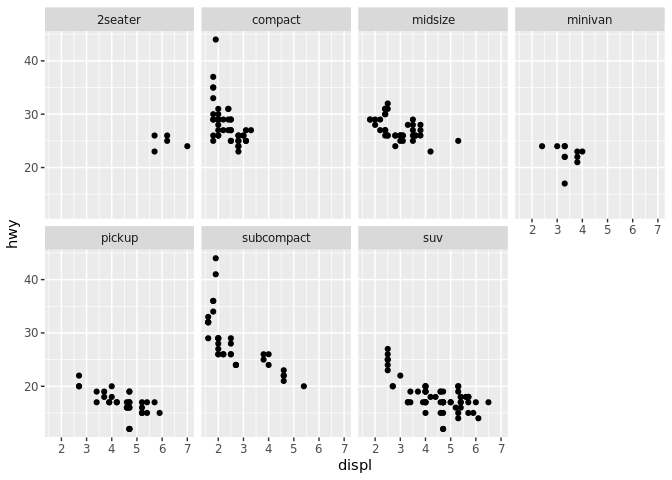

``` r
ggplot(data = mpg) + 
  geom_point(mapping = aes(x = displ, y = hwy)) + 
  facet_grid(drv ~ cyl)
```


###### **3.6**

-   **Geoms** are different geometric shapes used in the graph
    -   bars, points, lines, ect.

``` r
# left
ggplot(data = mpg) + 
  geom_point(mapping = aes(x = displ, y = hwy))
```


``` r
# right
ggplot(data = mpg) + 
  geom_smooth(mapping = aes(x = displ, y = hwy))
```

    ## `geom_smooth()` using method = 'loess' and formula 'y ~ x'

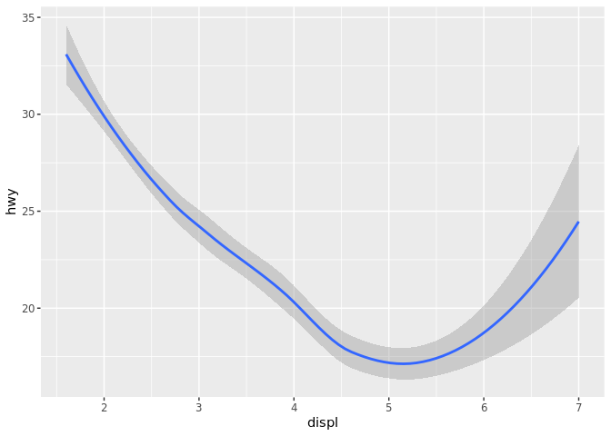

###### **3.7**

-   We will look at bar plots
    -   Bars seem simple but have many things that go into creating them

``` r
ggplot(data = diamonds) + 
  geom_bar(mapping = aes(x = cut))
```

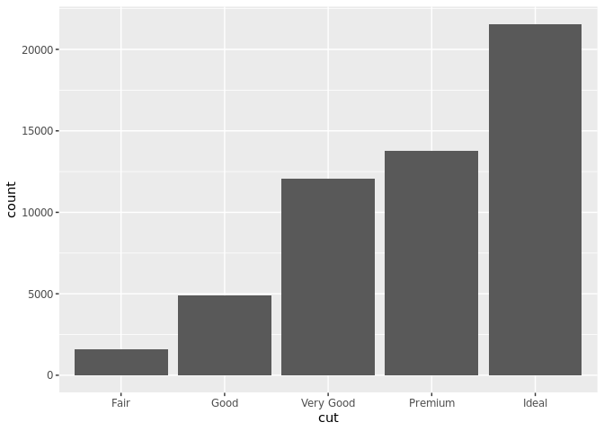

###### **3.8**

-   You can color bar chart using **colour** or **fill**

``` r
ggplot(data = diamonds) + 
  geom_bar(mapping = aes(x = cut, colour = cut))
```

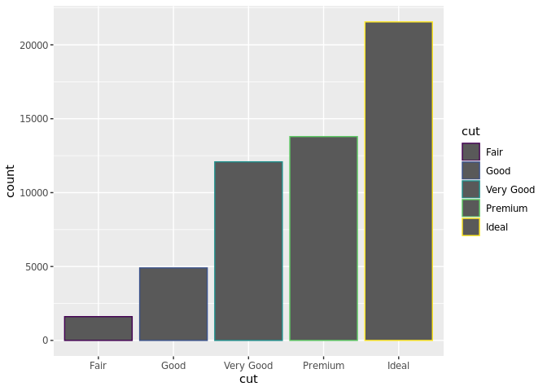

``` r
ggplot(data = diamonds) + 
  geom_bar(mapping = aes(x = cut, fill = cut))
```

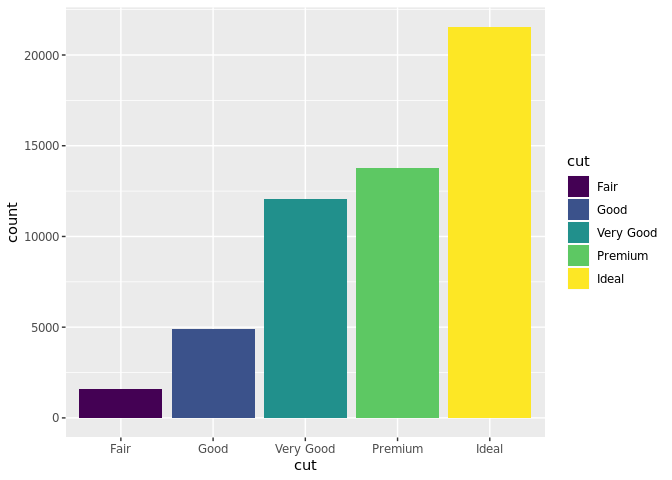 \* You can also fill with another variable

``` r
ggplot(data = diamonds) + 
  geom_bar(mapping = aes(x = cut, fill = clarity))
```

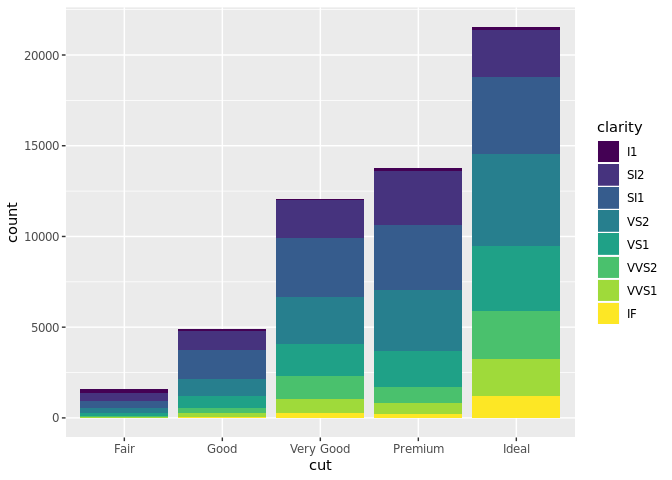

-   You can put bars next to each other with the **position** argument

``` r
ggplot(data = diamonds) + 
  geom_bar(mapping = aes(x = cut, fill = clarity), position = "dodge")
```

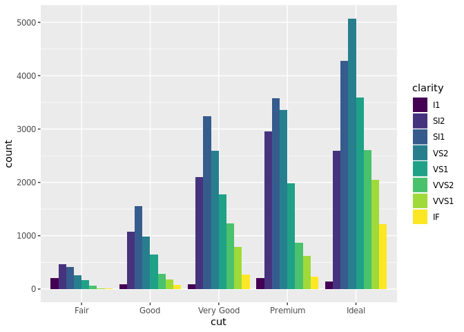

###### **3.9**

-   You can flip the x and y axis with a quick function

``` r
ggplot(data = mpg, mapping = aes(x = class, y = hwy)) + 
  geom_boxplot()
```


``` r
ggplot(data = mpg, mapping = aes(x = class, y = hwy)) + 
  geom_boxplot() +
  coord_flip()
```

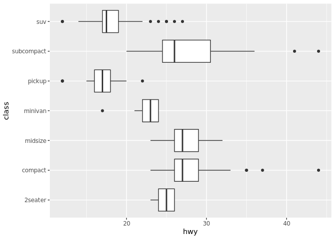

###### **3.10**

-   Basic layering with ggplot

ggplot(data = *DATA*) + *GEOM\_FUNCTION*( mapping = aes(*MAPPINGS*), stat = *STAT*, position = *POSITION*) + *COORDINATE\_FUNCTION* + *FACET\_FUNCTION*
